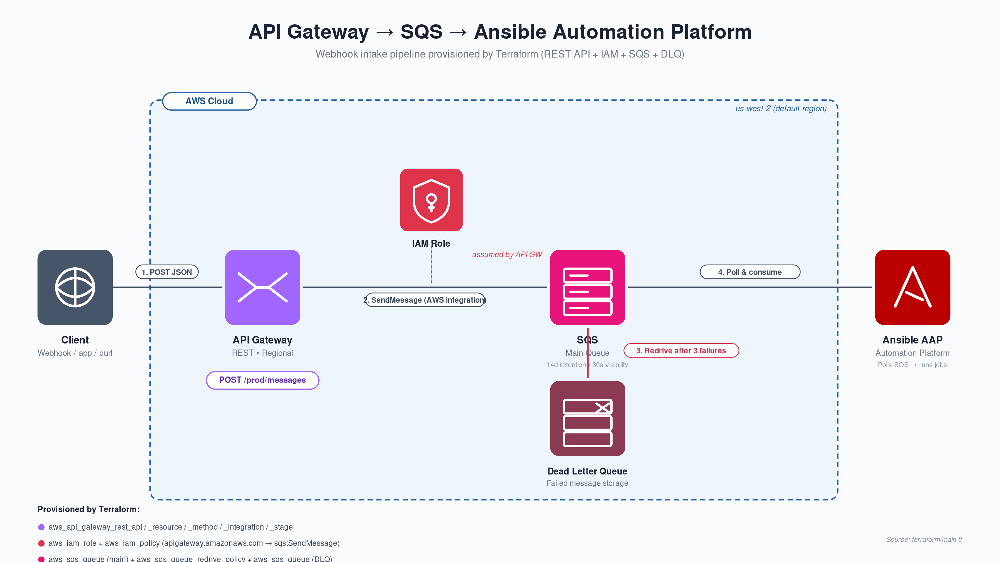

# AWS API Gateway → SQS → AAP EDA — Proof of Concept

A proof-of-concept for the City and County of Denver that provisions a serverless webhook endpoint using AWS API Gateway integrated directly with Amazon SQS (no Lambda). Ansible Automation Platform's Event-Driven Ansible (EDA) component polls the SQS queue and triggers job templates in response to incoming messages.



---

## Overview

Ansible playbooks running on AAP need a way to deliver job results, form-submission notifications, or other event payloads to an asynchronous queue that downstream automation can consume. This PoC replaces a custom Lambda function with a direct AWS service integration, keeping the stack minimal and the operational surface small.

**End-to-end flow:**

```
HTTP POST (AAP playbook / any HTTP client)
    └─► API Gateway REST API  (REGIONAL endpoint, no auth)
            └─► AWS SQS SendMessage  (direct AWS integration, no Lambda)
                    └─► EDA rulebook  (aws_sqs_queue source plugin polls queue)
                            └─► AAP Job Template  (run_job_template action)
                                    └─► site.yml playbook  (sends Teams notification)
```

---

## Repository Structure

```
.
├── terraform/               # All AWS infrastructure (API GW, SQS, IAM)
│   ├── main.tf              # Core resources
│   ├── variables.tf         # Input variables with defaults
│   ├── outputs.tf           # Exported values (invoke URL, queue URL, etc.)
│   ├── terraform.tfvars.example
│   └── diagrams/            # Architecture diagrams (PNG, SVG, PDF, PPTX)
├── rulebooks/
│   └── rulebook.yml         # EDA rulebook — listens on SQS, fires job templates
├── scripts/
│   └── create_aap_credential.py  # Bootstraps a custom EDA credential type in AAP
├── testing/
│   └── test_api_gw_integration.sh  # Sends a POST every 5 s for smoke testing
└── site.yml                 # Ansible playbook — sends a Teams channel notification
```

---

## Architecture Details

### API Gateway

- **Type:** REST API, `REGIONAL` endpoint
- **Integration type:** `AWS` (direct service integration — no Lambda)
- **VTL mapping template:**
  ```
  Action=SendMessage&MessageBody=$util.urlEncode($input.body)
  ```
  The raw JSON request body is URL-encoded and passed as the SQS `MessageBody`.
- **CORS:** An `OPTIONS` mock integration returns `Access-Control-Allow-*` headers so browser-based clients can call the endpoint.
- **Redeployment:** A `sha1` trigger on key resource IDs ensures `terraform apply` redeploys the stage whenever the API configuration changes.

### SQS

| Queue | Purpose |
|-------|---------|
| Main queue (`sqs_queue_name`) | Receives all messages from the API Gateway |
| DLQ (`<name>-dlq`) | Receives messages after 3 failed receive attempts |

- Message retention: **14 days**
- Visibility timeout: **30 seconds**

### IAM

The API Gateway assumes a dedicated IAM role (`apigateway.amazonaws.com`) that has only `sqs:SendMessage` and `sqs:GetQueueAttributes` on the main queue ARN — no broader permissions.

### EDA Rulebook

The rulebook (`rulebooks/rulebook.yml`) uses the `ansible.eda.aws_sqs_queue` source plugin to poll the queue every 10 seconds. Two rules are defined:

| Rule | Condition | Action |
|------|-----------|--------|
| Launch job template | `event.meta is defined` | `run_job_template` |
| Debug error events | `event.error is defined` | `debug` |

AWS credentials are injected at runtime via a custom EDA credential type (see [AAP Credential Setup](#aap-credential-setup) below).

### Ansible Playbook

`site.yml` is the job template payload. It:
1. Prints the full EDA event payload as JSON (debug task).
2. Sends a Teams channel notification using the `ccd.master_roles.teams_send_message_to_channel` role, pulling field values directly from `ansible_eda.event.body`.

---

## Prerequisites

| Requirement | Notes |
|-------------|-------|
| Terraform ≥ 1.0 | AWS provider `~> 5.0` |
| AWS CLI configured | Credentials with IAM, API Gateway, and SQS permissions |
| Ansible Automation Platform | With Event-Driven Ansible enabled |
| Python 3 + `requests` | Only for `create_aap_credential.py` |

---

## Deployment

### 1. Provision AWS infrastructure

```bash
cd terraform

# Copy and edit variables
cp terraform.tfvars.example terraform.tfvars
# Edit terraform.tfvars — set project_name, sqs_queue_name, aws_region, tags, etc.

terraform init
terraform plan
terraform apply
```

Retrieve the outputs after deployment:

```bash
terraform output -raw api_gateway_invoke_url   # POST endpoint URL
terraform output -raw sqs_queue_url            # SQS queue URL for the EDA rulebook
```

### 2. Set up the AAP credential type

The EDA source plugin needs AWS credentials injected as extra vars. Run the helper script once against your AAP instance:

```bash
# Edit scripts/create_aap_credential.py — set AAP_HOST, AAP_TOKEN, and the
# AWS key/secret/region in CREDENTIAL_PAYLOAD before running.
python3 scripts/create_aap_credential.py
```

This creates:
- A custom credential type named **"AWS SQS EDA"** with fields `aws_access_key_id`, `aws_secret_access_key`, and `aws_region`.
- A credential instance named **"AWS SQS EDA - Dev"** populated with the values you provided.

### 3. Activate the EDA rulebook

In the AAP UI:
1. Create a **Rulebook Activation** pointing to `rulebooks/rulebook.yml`.
2. Attach the **"AWS SQS EDA - Dev"** credential created above.
3. Set `template_name` and `template_org` variables to match your job template.

### 4. Create the Job Template

Create a job template in AAP that runs `site.yml`. Attach a Vault credential that provides `ansible_AD_user.yml` (required for the Teams notification role).

---

## Configuration Reference

### Terraform Variables

| Variable | Default | Description |
|----------|---------|-------------|
| `aws_region` | `us-west-2` | AWS region for all resources |
| `project_name` | `ansible-api-gateway-sqs-poc` | Prefix for IAM resource names |
| `sqs_queue_name` | `ansible-api-gateway-messages` | Main queue name; DLQ is `<name>-dlq` |
| `api_gateway_name` | `ansible-sqs-integration-api` | REST API display name |
| `api_resource_path` | `messages` | URL path segment (`/messages`) |
| `api_stage_name` | `prod` | Deployment stage name |
| `cors_allowed_origin` | `*` | `Access-Control-Allow-Origin` value |
| `throttle_burst_limit` | `100` | Max concurrent requests |
| `throttle_rate_limit` | `50` | Requests per second |
| `tags` | See `variables.tf` | Tags applied to all resources |

### Terraform Outputs

| Output | Description |
|--------|-------------|
| `api_gateway_invoke_url` | Full POST endpoint URL |
| `sqs_queue_url` | Main queue URL (used by the EDA rulebook) |
| `sqs_queue_arn` | Main queue ARN |
| `sqs_dlq_url` | Dead letter queue URL |
| `api_gateway_id` | REST API ID |
| `api_gateway_arn` | REST API ARN |
| `iam_role_arn` | IAM role ARN assumed by API Gateway |

---

## Testing

### Quick smoke test

```bash
API_URL=$(cd terraform && terraform output -raw api_gateway_invoke_url)
curl -X POST "$API_URL" \
  -H "Content-Type: application/json" \
  -d '{"message": "test", "timestamp": "2025-01-01T00:00:00Z"}'
```

A successful response returns HTTP 200 with:
```json
{"message": "Message sent to SQS successfully"}
```

### Continuous load test

```bash
bash testing/test_api_gw_integration.sh
# Sends one POST every 5 seconds until interrupted (Ctrl+C)
```

### Verify message delivery

```bash
QUEUE_URL=$(cd terraform && terraform output -raw sqs_queue_url)
aws sqs receive-message --queue-url "$QUEUE_URL"
```

---

## Security Considerations

- The API Gateway endpoint has **no authentication**. For production, add API keys, a usage plan, or AWS WAF.
- The IAM role follows least privilege — `sqs:SendMessage` and `sqs:GetQueueAttributes` scoped to the main queue ARN only.
- The DLQ provides visibility into messages that failed to be processed.
- Store AWS credentials for EDA in AAP's encrypted credential store, not in plaintext files.
- Use Ansible Vault for the `ansible_AD_user.yml` vars file referenced by `site.yml`.
- Consider restricting `cors_allowed_origin` to your AAP server's hostname if browser access is not required.

---

## Teardown

```bash
cd terraform
terraform destroy
```

---

## Troubleshooting

| Symptom | Likely cause |
|---------|-------------|
| `403 Forbidden` from API Gateway | IAM role policy not attached or missing `sqs:SendMessage` |
| Message arrives but body is double-encoded | VTL template applied twice; verify integration type is `AWS` not `AWS_PROXY` |
| Message not appearing in SQS | API Gateway integration not saved/deployed; run `terraform apply` again |
| EDA rulebook not firing | `event.meta` not present in the incoming payload; check rulebook condition |
| Teams notification fails | Vault credential not attached to job template, or `ansible_AD_user.yml` path incorrect |
| CORS error in browser | `OPTIONS` integration not deployed; run `terraform apply` |
